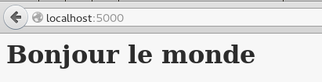
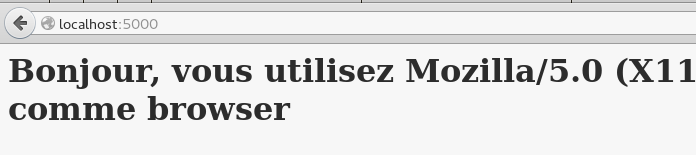
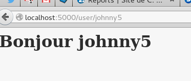

:title: Formation Flask
:author: Christophe Brun <christophe.brun.cl194@gadz.org>
:event: FHackTory
:description: Formation
:data-transition-duration: 1400
:pygments: monokai

----

:id: homepage

Formation Framework Flask
=========================

Christophe Brun
---------------

----

:id: Introduction

Introduction
============

* Flask est un micro-framework python
    * strict nécessaire pour développer
    * extensible
    * socle solide
* Fonctionnalité (de base ou par dépendance)
    * un socle
    * routeur d'url
    * debugging 
    * WSGI
    * templating via Jinja2

----

:id: env_virtuel

Environnement virtuel
=====================

* Utilisation de virtualenvwrapper

.. code-block:: bash

    mkvirtualenv [nomEnvironnement]

* Si mkvirtualenv n'existe pas

.. code-block:: bash

    apt-get install virtualenvwrapper

* Activer l'environnement

.. code-block:: bash

    workon [nomenvironnement]

* Sortir de l'environnement virtuel

.. code-block:: bash

    deactivate

----

:id: installation_flask

Installation Flask
==================

* Entrer dans l'environnement virtuel
* Lancer la commande pip :

.. code-block:: bash

    pip install flask

----

:id: application_simple_1

Application de base
===================

* Définition de l'application (ouvrir un dichier app1.py)

.. code-block:: python

    from flask import Flask

    app = Flask(__name__)

* Une route pour la page d'accueil (ajouter à app1.py)

.. code-block:: python

    @app.route('/')
    def index():
        return '<h1>Bonjour le monde</h1>'

* On démarre l'application, en mode debug

.. code-block:: python

    if __name__ == '__main__':
        app.run(debug=True)

----

:id: application_simple_1_complet

Application de base complète
============================

.. code-block:: python

    from flask import Flask

    app = Flask(__name__)

    @app.route('/')
    def index():
        return '<h1>Bonjour le monde</h1>'

    if __name__ == '__main__':
        app.run(debug=True)

* On lance l'application

.. code-block:: bash

    python app1.py

* lancer l'application et appeler l'url : http://localhost:5000/

----

:id: application_simple_2

Application 2 : Request
=======================

Pour récupérer le user-Agent

.. code-block:: python

     from flask import Flask, request

    app = Flask(__name__)

    @app.route('/')
    def index():
        user_agent = request.headers.get('User-Agent')
        return '<h1>Bonjour, vous utilisez %s comme browser</h1>' % user_agent

    if __name__ == '__main__':
        app.run(debug=True)

* lancer l'application et appeler l'url : http://localhost:5000/

----

:id: application_simple_3

Route paramétrée
================

.. code-block:: python

     from flask import Flask, request

    app = Flask(__name__)

    @app.route('/')
    def index():
        user_agent = request.headers.get('User-Agent')
        return '<h1>Bonjour, vous utilisez %s comme browser</h1>' % user_agent

    @app.route('/user/<nom>')
    def user_name(nom):
        return '<h1>Bonjour %s</h1>' % nom

    if __name__ == '__main__':
        app.run(debug=True)

* lancer l'application et appeler l'url : http://localhost:5000/user/jhonny5

----

:id: application_simple_4

Templating : jinja2
===================

* modification de l'application

.. code-block:: python

    from flask import Flask, render_template

    app = Flask(__name__)

    @app.route('/user/<nom>')
    def index(nom):
        return render_template('index.html', name=nom)

    if __name__ == '__main__':
        app.run(debug=True)

* edition du template : **template/index.html**

.. code-block:: jinja

    <h1>Bonjour {{name}}</h1>

* Même appel que app3 = même résultat

----

:id: jinja2_1

Templating : Variable
=====================

* Utilisation des variables ou résultats de fonction

.. code-block:: jinja

    {{ Variable}}
    {{ element_dun_dico['cle'] }}
    {{ valeur_dune_liste[3] }}
    {{ autre_valeur_dune_liste[num_item] }}
    {{ objet.function() }}

* Les filtres

.. code-block:: jinja
    
    {{ variable|filtre }}

* Avec, par exemple :
    * **safe** : retourne la valeur sans escaping
    * **capitalize** : 1ère lettre en majuscule, le reste en minuscule
    * **lower** : Tt en minuscule
    * **upper** : Tt en majuscule
    * **trim** : Suppression des espaces à gauche et à droite
    * **striptags** : Suppression des balises html

----

:id: jinja2_2

Templating : structures de contrôle
===================================

* Condition

.. code-block:: jinja

    
        condition est vrai
    
        sinon
    

* Boucle

.. code-block:: jinja

    
        Code
    

----

:id: jinja2_3

Templating : Macros
===================

* Définition de la macro

.. code-block:: jinja

    
        <li>{{ item }}</li>
    

* Utilisation des macros

.. code-block:: jinja
    
    
        {{ macros.ma_macro(elemnt) }}
    

----

:id: jinja2_4

Templating : Block
==================

* Definition d'un block
 
.. code-block:: jinja

    
        Contenu par defaut du block
    

* Surcharge du contenu du block

.. code-block:: jinja

    
         Mon nouveau contenu
    

* Surcharge, en gardant le contenu parent

.. code-block:: jinja

    
        {{ super }}
         Mon nouveau contenu
    
